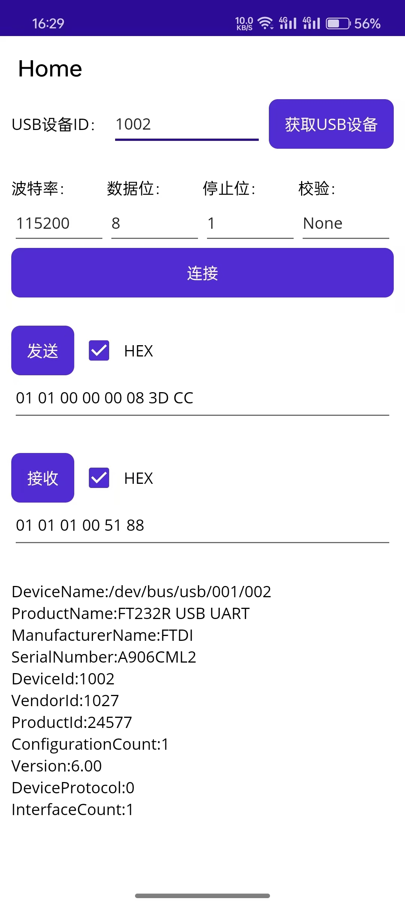
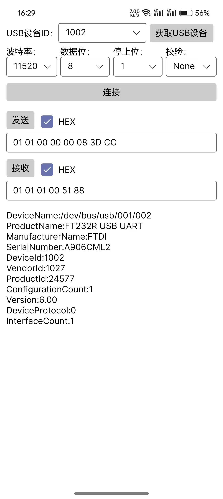

# UsbSerialForAndroid.Net

[中文](./README_CN.md)

### 👓 Introduce
This is an android USB serial communication driver library . Support MAUI, Avalonia Android platform USB serial hardware for communication . The library supports Android 6.0 (API23.0) as a minimum. Because net6.0-android is no longer supported, net8.0-android is supported at least. It uses Android 3.1+ available on [Android USB Host API](http://developer.android.com/guide/topics/connectivity/usb/host.html)。

No root access, ADK, or special kernel drivers required; All drivers are implemented in C#. Obtain the DeviceId based on the VendorID and ProductID of the device. Automatically select an appropriate driver for read and write.

This library is based on Java to implement open source library[usb-serial-for-android](https://github.com/mik3y/usb-serial-for-android) and C# implementation of the open source library modification[UsbSerialForAndroid](https://github.com/anotherlab/UsbSerialForAndroid)

### 💡 How to Use

If you want to broadcast the receiving USB insert and unplug, this needs to be registered in the constructor
```
//Registered broadcast receiver
//isShowToast=true After USB authorization, Toast will be displayed
//attached USB device added after the delegate
//detached USB device removed after the delegate
//errorCallback Broadcast receiver internal OnReceive() method error callback
UsbDriverFactory.RegisterUsbBroadcastReceiver();

//Unregister the broadcast receiver
UsbDriverFactory.UnRegisterUsbBroadcastReceiver();
```

Get all currently inserted devices from the help class
```
var usbDevices = UsbManagerHelper.GetAllUsbDevices();
```

Create a driver, send and receive data, check whether the driver is supported before creation, and throw an exception if it is not supported
```
//This parameter is created using the device Id (DeviceId)
int deviceId = 0x03EA;
UsbDriverBase usbDriver = UsbDriverFactory.CreateUsbDriver(deviceId);

//Or create a VendorId and ProductId
int vendorId = 0x0403;
int productId = 0x6001;
UsbDriverBase usbDriver = UsbDriverFactory.CreateUsbDriver(vendorId,productId);

//Open the USB device and set the communication parameters
usbDriver.Open(115200, 8, StopBits.One, Parity.None);

//Send data
var data = new byte[] { 0x01, 0x01, 0x00, 0x00, 0x00, 0x08, 0x3D, 0xCC };
usbDriver.Write(data);

//Receive data
var buffer = usbDriver.Read();

//Close the USB device
usbDriver.Close();
```

### 🚀Supported Driver

**Technology Devices International, Ltd**

FTDI = 0x0403 Future 

- FT232R = 0x6001
- FT2232H = 0x6010
- FT4232H = 0x6011
- FT232H = 0x6014
- FT231X = 0x6015

**Prolific Technology, Inc.** 

Prolific = 0x067B 

- PL2303 = 0x2303
- PL2303GC = 0x23A3
- PL2303GB = 0x23B3
- PL2303GT = 0x23C3
- PL2303GL = 0x23D3
- PL2303GE = 0x23E3
- PL2303GS = 0x23F3

**QinHeng Electronics** 

QinHeng = 0x1A86 

- HL340 = 0x7523
- CH341A = 0x5523

**Silicon Labs** 

SiliconLabs = 0x10C4

- CP2102 = 0xEA60
- CP2105 = 0xEA70
- CP2108 = 0xEA71
- CP2110 = 0xEA80

### 🎨DEMO截图

| MAUI | Avalonia |
| ----------- | ----------- |
|  |  |

